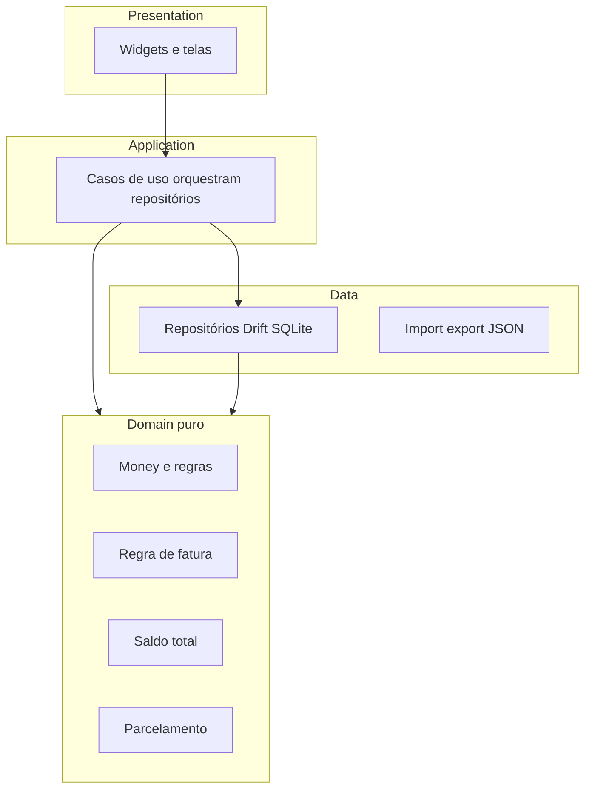

# Plano SCRUM/TDD a partir do domain.md (Flutter)

**Contexto:** O [domain.md](/home/hidemitsu/Documents/repositories/vfinance/domain.md) define o produto e as regras críticas (valores em **centavos**, cartão não altera saldo imediato, regra de **closingDay**, saldo = contas − faturas abertas, parcelamento, backup por ano, offline). Você escolheu **Flutter/Dart**. A persistência local em produção está detalhada na secção seguinte; o plano continua a assumir **lógica de domínio** em **funções/classes puras** testadas sem I/O, com repositórios Drift finos por cima.

### Persistência local (decisão no ecossistema Flutter)

Para dados **relacionais** (contas, transações, cartões, faturas, parcelas), alinhados ao espírito do Room no domain, a opção mais sólida e recorrente em apps Flutter em produção é **[Drift](https://pub.dev/packages/drift)** (antes Moor):

- **SQLite real** com API **tipada em Dart**, queries verificadas em tempo de compilação, migrações e **streams** para UI reativa.
- Manutenção ativa e uso comum em cenários financeiros/complexos; reduz SQL ad-hoc em relação a usar só [`sqflite`](https://pub.dev/packages/sqflite) cru.
- O Drift usa `sqflite` nas plataformas móveis (e pode usar `sqlite3` em desktop); ou seja, a base continua sendo SQLite de produção, não um substituto “só para testes”.

**Alternativas na lista pub.dev (quando *não* escolher como stack principal):**

- **`sqflite`**: controle total e dependência mínima, porém mais boilerplate SQL manual, menos segurança de tipo e mais risco de erro em queries — aceitável se a equipa quiser SQL explícito sem camada ORM.
- **[Floor](https://pub.dev/packages/floor)**: estilo Room com anotações; ecossistema em geral **menos** ativo que o Drift para projetos longos.
- **Isar / Hive**: armazenamentos não relacionais ou orientados a documento; para o modelo do `domain.md` (várias tabelas ligadas, faturas por ciclo), são **piores encaixe** do que SQLite, salvo requisitos muito específicos de performance documentados.

**Testes:** TDD continua a privilegiar **unidades de domínio**. Onde fizer sentido, testes de integração podem usar **SQLite em memória** via APIs do Drift — isso é **estratégia de teste**, não a definição da ferramenta de persistência do app.

**Princípio TDD (todas as fases):** para cada tarefa — 1) escrever teste que falha (cenário de negócio); 2) implementação mínima; 3) refatorar. **Não** adicionar testes de framework, snapshots de UI ou “cobertura genérica” sem valor de negócio.

**Arquitetura sugerida (testável):**

---

## Fase 0 — Fundação de dinheiro e invariantes (Sprint 0)

**Objetivo do incremento:** Nenhuma lógica financeira usa `double`/`float` para persistência ou arredondamento de negócio; operações básicas de valor estão cobertas por testes.

| História (formato resumido) | Tarefas (pequenas, TDD) | O que o teste de negócio prova |
|----------------------------|-------------------------|--------------------------------|
| **H0.1** Como sistema, quero representar valores só em centavos, para evitar erros de ponto flutuante. | **T0.1** `Money` (ou `typedef`/classe imutável): soma, subtração, negação, `isNegative`/`isPositive`. | Soma/subtração correta em centavos; sinais. |
| | **T0.2** Parsing/formato exibido: string BR → centavos e formatação para exibição (só o necessário ao app). | Entradas típicas `"10,50"` / `"0.99"` → centavos esperados; casos inválidos rejeitados ou tratados conforme regra que vocês fixarem. |
| **H0.2** Como sistema, quero enums explícitos de tipo e meio de pagamento. | **T0.3** `TransactionType` e `PaymentMethod` (Dart `enum`) + serialização para string igual ao contrato do domain (para Room/Drift e JSON). | Round-trip nome ↔ valor usado no armazenamento/backup. |

**Entrega:** pacote ou pasta `lib/domain/` (ou `core/money/`) só com Dart puro + testes em `test/`.

---

## Fase 1 — Contas, transações e saldo (roadmap “Fase 1”)

**Objetivo:** CRUD mínimo de contas e transações offline + **saldo de conta** e **saldo total** conforme fórmula do documento.

| História | Tarefas (TDD) | Teste de negócio |
|----------|---------------|------------------|
| **H1.1** Registrar receita/despesa ligada a conta (PIX, débito, boleto afetam saldo). | **T1.1** Regra: ao registrar transação com meio que **não** é crédito, atualizar saldo da conta em centavos (função pura ou “calculator” recebendo estado + evento). | Dado saldo inicial e transação, saldo final correto. |
| **H1.2** Despesa no crédito **não** altera saldo de conta imediato. | **T1.2** Mesma API: transação `PaymentMethod.credit` não muda `Account.balanceInCents`. | Saldo inalterado para crédito. |
| **H1.3** Saldo total do usuário. | **T1.3** Função pura `totalBalance(accounts, openInvoiceTotals)` = soma saldos contas − soma totais de faturas **abertas** (usar `adjustedTotalInCents` quando não nulo, senão `totalInCents` — alinhado ao domain). | Matriz pequena: 2 contas, 0–N faturas abertas, resultados esperados. |
| **H1.4** Persistência. | **T1.4** Schema **Drift** (SQLite produção) espelhando `Account`, `Transaction`; DAOs/repositório; teste de integração **só se** o negócio exigir (ex.: “inserir e ler saldo”). Maior parte da lógica em **testes unitários** sobre funções puras. | Invariantes após sequência de operações (opcional: um teste de integração pontual). |

**Entrega:** telas mínimas ou debug UI opcional; núcleo testável pronto.

---

## Fase 2 — Cartão e fatura (roadmap “Fase 2”)

**Objetivo:** Fechamento de fatura por **closingDay**; agregar transações na fatura correta; suporte a `adjustedTotalInCents` sem mutar transações.

| História | Tarefas (TDD) | Teste de negócio |
|----------|---------------|------------------|
| **H2.1** Compra vai para fatura atual ou próxima. | **T2.1** Função pura: `(dataCompra, closingDay)` → identificador lógico de ciclo (mês/ano da fatura) conforme: dia ≤ closing → fatura atual; senão → próxima. | Tabela de exemplos (mesmo mês / virada de mês / ano). |
| **H2.2** Total da fatura. | **T2.2** `invoiceTotal(transactions)` = soma `amountInCents` (apenas transações daquele cartão/ciclo). **T2.3** Se `adjustedTotalInCents != null`, valor exibido/usado no saldo total é o ajustado. | Soma correta; substituição pelo ajustado quando presente. |
| **H2.3** Estados `isClosed` / `isPaid`. | **T2.4** Regra pura: fatura aberta entra no desconto do saldo total; fechada paga não entra (definir matriz no teste com base no domain). | Saldo total muda só com faturas “abertas” relevantes. |

---

## Fase 3 — Parcelamento (roadmap “Fase 3”)

**Objetivo:** `Installment` + N transações futuras; valor por parcela; datas mensais.

| História | Tarefas (TDD) | Teste de negócio |
|----------|---------------|------------------|
| **H3.1** Dividir total em N parcelas. | **T3.1** Divisão em centavos com correção de resto (ex.: última parcela absorve centavos faltantes) — comportamento deve ser **documentado no teste** como regra de produto. | Total das parcelas = total original; N parcelas; nenhuma negativa. |
| **H3.2** Gerar datas mensais. | **T3.2** A partir da data base, N-1 incrementos mensais (regra de “mesmo dia do mês” ou último dia — fixar no teste). | Lista de datas esperadas para casos limite (jan 31 → fev). |
| **H3.3** Integração com crédito/fatura. | **T3.3** Cada parcela como transação crédito ligada ao mesmo `installmentId`; primeira parcela na fatura correta via **T2.1**. | Orquestração: pode ser 1–2 testes que montam estruturas mínimas. |

---

## Fase 4 — Backup e restauração JSON por ano (roadmap “Fase 4”)

**Objetivo:** Export filtrado por ano; import apaga dados daquele ano e reinsere (conforme domain).

| História | Tarefas (TDD) | Teste de negócio |
|----------|---------------|------------------|
| **H4.1** Serializar/deserializar snapshot do ano. | **T4.1** Mapper JSON ↔ entidades (campos em centavos, enums como string). Validar **round-trip** em memória. | Objeto domain → JSON → domain igual (para exemplos representativos). |
| **H4.2** Política de restauração. | **T4.2** Função pura ou use case testado com repositório fake: “deletar por ano + inserir lista” em ordem **sem** apagar outros anos. | Estado final esperado após import. |
| **H4.3** SAF / file_picker. | Implementação de UI/plataforma; **testes** só onde houver lógica (ex.: nome `gastos_YYYY.json`), não mockar SAF em excesso. | Um teste unitário do gerador de nome/filtro de ano, se extrair função pura. |

---

## Fase 5 — Frontend (interface Flutter)

**Objetivo:** Entregar telas utilizáveis offline-first sobre o domínio e os repositórios já existentes: navegação clara, listagens e formulários mínimos, valores sempre exibidos a partir de centavos (formatação BR), e feedback de erro carregável. TDD permanece **focado em regras**; UI usa principalmente testes de widget **pontuais** onde reduzem regressão (ex.: um fluxo crítico de salvar transação).

| História | Tarefas | Validação |
|----------|---------|-----------|
| **H5.1** Como utilizador, quero ver contas e saldos, para acompanhar o dinheiro nas contas correntes. | **T5.1** Tema centralizado (`ThemeData` / tokens); **T5.2** Lista de contas + detalhe com saldo formatado; integração com repositório/stream Drift. | Critérios de aceite manuais + analyzer limpo; widget test opcional no fluxo “lista vazia → uma conta”. |
| **H5.2** Como utilizador, quero registar receitas e despesas, para atualizar o histórico e o saldo. | **T5.3** Ecrã de nova transação: tipo, meio de pagamento, conta, valor (entrada BR → centavos via domínio), data; lista filtrada por conta/ período simples. | Despesa em débito altera saldo visualmente; crédito não altera saldo de conta (alinhado Fase 1). |
| **H5.3** Como utilizador do cartão, quero ver fatura e saldo total, para fechar o ciclo mental “quanto devo no cartão”. | **T5.4** Lista de faturas por cartão; destaque total / ajustado; saldo total na shell ou dashboard usando regra já testada no domínio. | Smoke manual com 2+ faturas abertas; sem duplicar testes de `invoice_rules` na UI. |
| **H5.4** Como utilizador, quero navegar sem perder contexto, para usar o app no dia a dia. | **T5.5** `go_router` (ou equivalente já adotado no repo): rotas para contas, transações, cartão/fatura; estados de loading/erro em chamadas ao repositório. | Deep link básico se aplicável à plataforma alvo. |

**Entrega:** `lib/` presentation (widgets, rotas) consumindo casos de uso ou repositórios; sem `double` no modelo apresentado para valores persistidos.

---

## Fase 6 — Entrada por voz (roadmap “Fase 5” do domain.md)

**Objetivo:** Speech-to-text nativo + parser; extrair valor e categoria; criar `Transaction` em centavos.

| História | Tarefas (TDD) | Teste de negócio |
|----------|---------------|------------------|
| **H6.1** Parser de frases. | **T6.1** Função pura `parseVoiceExpense(String text)` → `{ Money? amount, String? category }` com frases exemplo PT-BR (“gastei 25 reais mercado”). | Casos de sucesso e falha; sem dependência de microfone. |
| **H6.2** Integração STT. | Implementação com plugin/serviço; **sem** TDD pesado na plataforma — validação manual ou teste de integração mínimo se houver abstração testável. | N/A ou smoke. |

---

## Rituais SCRUM (leve, recomendado)

- **Product Goal:** app financeiro pessoal offline, centavos exatos, faturas e backup confiáveis.
- **Definition of Done (sugestão):** testes de negócio passando; sem `double` em valores persistidos; critério de aceite da história verificável.
- **Sprints:** 1–2 semanas por fase ou subdividir Fase 1–2 se o time for menor; cada sprint fecha incremento utilizável.

---

## Dependências e ordem

- **Fase 0** antes de tudo.
- **F1** antes de **F4** (backup precisa do modelo estável).
- **T1.3** (saldo total) pode ser refinado quando **F2** existir, mas a assinatura já deve usar “totais de fatura aberta” com suporte a ajuste.
- **F3** depende de **F2** (crédito/fatura) e **F0** (Money + divisão).
- **F5** (frontend) assume **F1** e, para cartão/saldo total coerente na UI, **F2** (e **F3** se listar parcelas); pode avançar em paralelo a **F4** desde que o ecrã de backup/import não bloqueie o núcleo.
- **F6** (voz) pode seguir **F5** para reutilizar o mesmo ecrã de confirmação de transação, mas o parser **T6.1** permanece testável sem UI.

---

## Arquivos de referência no repo

- Requisitos e entidades: [domain.md](/home/hidemitsu/Documents/repositories/vfinance/domain.md)
-bootstrap atual: [lib/main.dart](/home/hidemitsu/Documents/repositories/vfinance/lib/main.dart)
